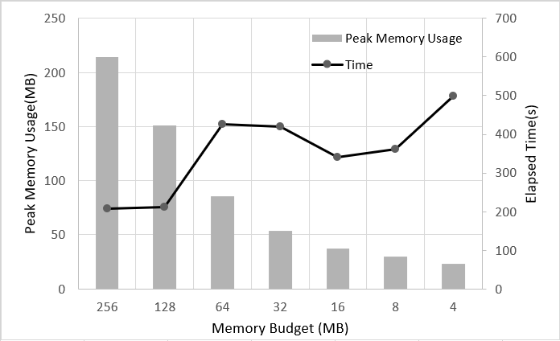

# CNN-on-flash
The goal of this project to run Convolutional Neural Network layers for flash-resident-matrices.
Now gemm using ARM CPU is implemented.

## References
This project is implemented based on BLAS-on-flash and run using Arm Compute Library
* BLAS-on-flash  [https://github.com/microsoft/BLAS-on-flash][bof]
* Arm Compute Library  [https://github.com/ARM-software/ComputeLibrary][acl]

## Requirements
* Ubuntu 16.04
* Arm Compute Library 19.02
  * built with neon option turned on

## Setting options
Set CMakeFiles options as you want.
```
vim CMakeFiles
```
* _PROGRAM\_BUDGET_  Memory budget of the gemm with byte size
* _GEMM\_BLK\_SIZE_  The number of rows and cols of submatrices
* _N\_IO\_THR_  The number of IO threads
* _N\_COMPUTE\_THR_  The number of compute threads

## Build instructions
* `git clone`
* `vim CMakeLists.txt`
    * modify `set (ACL_ROOT [arm_compute_library_path])` 
* `mkdir bin && cd bin`
* `cmake ..`
* `make`
* `cd ..`

## Execution
gemm execution
* `cd misc`
* `chmod +x gemm.sh`
* `./exec.sh [A_row] [B_row] [B_col]`

## Example result
Example case with _GEMM\_BLK\_SIZE_=512 and various memory budget
Inference time and maximum memory usage is shown on following graph.  



More detailed explanation for method and results can be found in [BLAS-on-flash paper][bof] and [this paper][gemtile].

[bof]:https://github.com/microsoft/BLAS-on-flash
[acl]:https://github.com/ARM-software/ComputeLibrary
[gemtile]:http://nyx.skku.ac.kr/wp-content/uploads/2019/07/16-502.pdf
